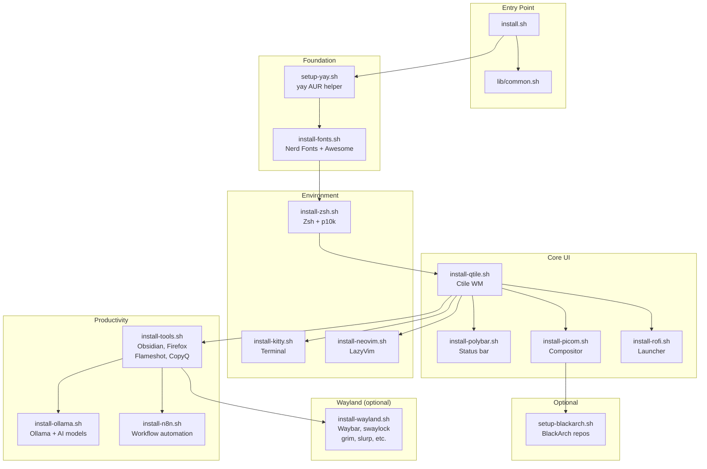
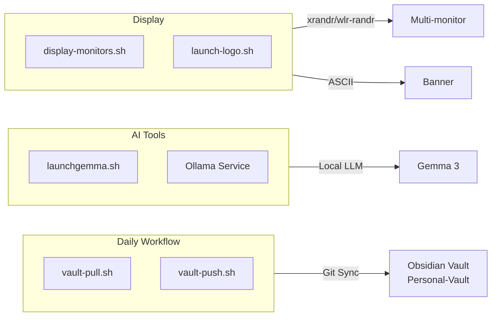

# Automatizaciones

## System Orchestration

El directorio `automat/` es el motor de automatizacion de los dotfiles. Contiene scripts modulares para bootstrap inicial del sistema, sincronizacion diaria y gestion de modelos AI.

### Shared Library (`lib/common.sh`)

Todos los scripts de instalacion usan `lib/common.sh` para evitar boilerplate. Proporciona:

| Funcion | Proposito |
|---------|-----------|
| `check_arch` | Verifica que el sistema sea Arch Linux |
| `detect_dotfiles_dir` | Localiza dinamicamente la raiz del repo |
| `install_pacman_pkg` | Instalacion idempotente con pacman |
| `install_yay_pkg` | Instalacion idempotente desde AUR |
| `stow_config` | Automatiza symlinks a `~/.config/` |

## Code Entity Mapping: Installation Flow



## Scripts de Automatizacion

### Utilidades del Sistema

| Script | Descripcion | Atajo |
|--------|-------------|-------|
| `display-monitors.sh` | Configura monitores (xrandr en X11, wlr-randr en Wayland) | `display-monitors` |
| `launch-logo.sh` | Muestra banner ASCII del dragon D4rkDr4g0n | `logo` |
| `launchgemma.sh` | Lanza Ollama + Gemma 3 en Kitty | `launchgemma` |
| `lock-screen.sh` | Lock screen (gtklock en Wayland, betterlockscreen en X11) | `Mod+L → Lock` |
| `barupdate.sh` | Reinicia la barra según el backend (Polybar/Waybar) | `barupdate` |
| `screenshot.sh` | Screenshot (grim+slurp en Wayland, Flameshot en X11) | `Print` / `Mod+Shift+S` |

### Vault (Obsidian)

| Script | Descripcion | Frecuencia |
|--------|-------------|------------|
| `vault-pull.sh` | `git pull` en `/files/Personal-Vault` | Al iniciar sesion |
| `vault-push.sh` | `git add/commit/push "D4 - YYYY-MM-DD"` | Al cerrar sesion |

## Code Entity Mapping: Workflow Utilities



## Scripts de Instalacion

| Script | Instala | Depende de |
|--------|---------|------------|
| `setup-yay.sh` | AUR helper (yay) | — |
| `install-fonts.sh` | Hack Nerd Font, JetBrains Mono, Font Awesome, Noto | — |
| `install-zsh.sh` | Zsh + powerlevel10k + symlinks | fonts |
| `install-qtile.sh` | Ctile + dependencias Python + session file | — |
| `install-polybar.sh` | Polybar + stow symlinks | — |
| `install-picom.sh` | Picom compositor + stow | — |
| `install-kitty.sh` | Kitty terminal + stow | — |
| `install-rofi.sh` | Rofi + sigma-file-manager | — |
| `install-neovim.sh` | Neovim + LazyVim starter | — |
| `install-tools.sh` | Obsidian, Flameshot, Firefox, CopyQ, Discord, Spotify + Wayland tools | yay |
| `install-wayland.sh` | Wayland packages: waybar, wlr-randr, swaybg, grim, slurp, swaylock, swayidle, wl-clipboard | — |
| `install-ollama.sh` | Ollama service + scripts de utilidad | — |
| `ollama-pull.sh` | Descarga modelos Ollama (~15GB) | ollama |
| `install-n8n.sh` | n8n workflow automation + systemd user service | — |
| `setup-blackarch.sh` | Repositorios BlackArch | — |

### Orden Recomendado

```bash
cd ~/dotfiles
bash automat/install/setup-yay.sh
bash automat/install/install-fonts.sh
bash automat/install/install-zsh.sh
bash automat/install/install-qtile.sh
bash automat/install/install-polybar.sh
bash automat/install/install-picom.sh
bash automat/install/install-kitty.sh
bash automat/install/install-rofi.sh
bash automat/install/install-neovim.sh
bash automat/install/install-tools.sh
bash automat/install/install-wayland.sh  # opcional, para sesion Wayland
bash automat/install/install-ollama.sh
bash automat/install/install-n8n.sh
bash automat/install/setup-blackarch.sh  # opcional
```

## Cambios Recientes

- **Unificacion**: Nuevo `install.sh` que instala todo con un solo comando
- **yay**: Ahora compila automaticamente (ya no requiere `makepkg -si` manual)
- **BlackArch**: Ahora ejecuta `strap.sh` automaticamente (con confirmacion)
- **n8n**: Ahora crea servicio de systemd user
- **Boilerplate eliminado**: Funciones comunes en `lib/common.sh`
- **Paths relativos**: Ya no usa `/home/lcampassi/dotfiles` hardcodeado
- **Bugfix**: `install-zsh.sh` ahora usa `stow -t ~/.config zsh` en vez de `stow -t $HOME zshrc`
