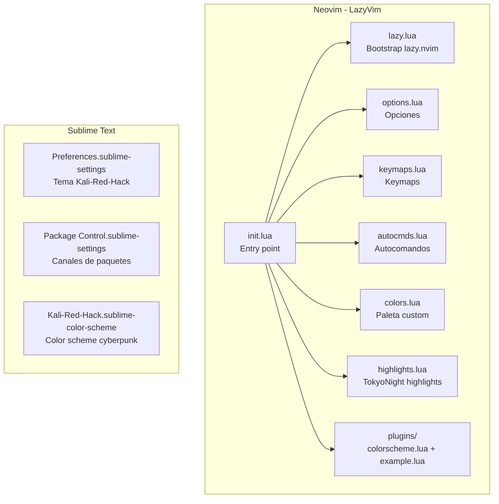

# Editores

## Diagrama de Arquitectura



## Tabla de Configuración

### Neovim

| Archivo | Rol | Características Clave |
|---------|-----|----------------------|
| `init.lua` | Entry point | Punto de entrada de LazyVim |
| `lua/config/lazy.lua` | Bootstrap | Inicializa lazy.nvim |
| `lua/config/options.lua` | Opciones | Defaults de LazyVim |
| `lua/config/keymaps.lua` | Keymaps | Atajos de teclado |
| `lua/config/autocmds.lua` | Autocomandos | Placeholder para eventos |
| `lua/config/colors.lua` | Colores custom | bg #0f0f0f, fg #c5c8c6, red #d32f2f |
| `lua/config/highlights.lua` | Highlights | Overrides de tokyonight |
| `lua/plugins/colorscheme.lua` | Tema | Tokyo Night |
| `lazy-lock.json` | Lock | Versiones bloqueadas de plugins |

### Sublime Text

| Archivo | Rol | Características Clave |
|---------|-----|----------------------|
| `Preferences.sublime-settings` | Configuración | Kali-Red-Hack, Hack 10pt, caret rojo, tema Dark |
| `Package Control.sublime-settings` | Paquetes | Canales de paquetes instalados |
| `Kali-Red-Hack.sublime-color-scheme` | Color scheme | Estética cyberpunk custom |

## Neovim -- LazyVim

**Ubicacion**: `lazy-nvim/`

### Estructura

```
lazy-nvim/
├── init.lua              # Entry point
├── lazy-lock.json        # Versiones bloqueadas de plugins
├── lazyvim.json          # Config LazyVim (v8, sin extras)
├── stylua.toml           # Formateo Lua
└── lua/
    ├── config/
    │   ├── lazy.lua       # Bootstrap lazy.nvim
    │   ├── options.lua    # Opciones (defaults de LazyVim)
    │   ├── keymaps.lua    # Keymaps (defaults de LazyVim)
    │   ├── autocmds.lua   # Autocomandos (placeholder)
    │   ├── colors.lua     # Paleta de colores custom
    │   └── highlights.lua # Highlights tokyonight
    └── plugins/
        ├── colorscheme.lua # Tokyo Night colorscheme
        └── example.lua     # Configuraciones de ejemplo (disabled)
```

### Colores Custom

Definidos en `lua/config/colors.lua`:

- `bg`: `#0f0f0f`
- `fg`: `#c5c8c6`
- `red`: `#d32f2f`
- `red_border`: `#a12020`

### Plugins Instalados

Via LazyVim + lazy-lock.json:

- blink.cmp (completado)
- bufferline.nvim (tabline)
- catppuccin / tokyonight.nvim (colores)
- conform.nvim (formateo)
- flash.nvim (navegacion)
- gitsigns.nvim (git)
- lualine.nvim (statusline)
- mason.nvim / mason-lspconfig (LSP)
- mini.ai, mini.icons, mini.pairs
- noice.nvim (UI)
- nvim-lint / nvim-lspconfig
- nvim-treesitter (parsing)
- persistence.nvim (sesiones)
- snacks.nvim
- todo-comments.nvim
- trouble.nvim
- which-key.nvim

---

## Sublime Text

**Ubicacion**: `sublime-text/Packages/User/`

### Configuracion

| Archivo | Descripcion |
|---------|-------------|
| `Preferences.sublime-settings` | Color scheme Kali-Red-Hack, Hack font 10pt, caret rojo (#d32f2f), tema Dark |
| `Package Control.sublime-settings` | Canales de paquetes instalados |
| `Kali-Red-Hack.sublime-color-scheme` | Color scheme custom con estetica cyberpunk |

### Paquetes Instalados

- **Dracula Color Scheme**
- **Okami - Adaptive Color Schemes**
- **Package Control**
- **Terminus** (terminal emulator integrado)

### Atajos

- `Mod + S` desde Qtile abre Sublime Text directamente
