# Fastfetch -- System Info

## Diagrama de Arquitectura

```mermaid
graph TB
    subgraph Config["Archivos de Configuración"]
        CF[config.jsonc<br/>Configuración principal]
        LOGO[ascii/<br/>Logos ASCII]
        PNG[png/<br/>Logos PNG]
    end

    subgraph Modules["Datos Mostrados"]
        OS[OS: Distribución + Kernel]
        DE[DE/WM: Qtile]
        PKG[Packages: pacman, yay]
        HW[Hardware: Host, CPU, GPU, Memoria]
        BAT[Battery: Estado de batería]
        UP[Uptime: Tiempo de actividad]
        TERM[Terminal: Kitty]
        LOC[Locale: Idioma / regional]
    end

    subgraph Style["Estilo"]
        SEP[Separator: ▸]
        ICON[Iconos Nerd Font]
        COLB[Color blocks]
        DCOL[Colores dinámicos del tema]
    end

    CF --> OS
    CF --> DE
    CF --> PKG
    CF --> HW
    CF --> BAT
    CF --> UP
    CF --> TERM
    CF --> LOC
    CF --> SEP
    CF --> ICON
    CF --> COLB
    CF --> DCOL
    CF --> LOGO
    CF --> PNG
```

## Archivos

| Archivo | Rol | Características Clave |
|---------|-----|----------------------|
| `config.jsonc` | Configuración principal | Módulos, separadores, iconos, colores dinámicos |
| `ascii/` | Logos ASCII | arch.txt, cat.txt, rose.txt |
| `png/` | Logos PNG | Variantes Arch Linux, logos personalizados, selección aleatoria |

**Ubicacion**: `fastfetch/`

## Configuracion

Fastfetch muestra informacion del sistema con un logo aleatorio de la carpeta `png/`.

### Datos Mostrados

- **OS**: Distribucion y kernel
- **DE/WM**: Entorno de escritorio / Qtile
- **Packages**: Paquetes instalados (pacman, yay, etc.)
- **Hardware**: Host, CPU, GPU, Memoria, Swap, Disk
- **Battery**: Estado de bateria
- **Uptime**: Tiempo de actividad
- **Terminal**: Kitty
- **Locale**: Idioma/configuracion regional

### Estilo

- **Separator**: ` ▸ `
- **Iconos**: Nerd Font con colores por categoria
- **Color blocks**: Barra de colores al final del output
- **Colores dinamicos**: Actualizados por el tema activo

## Logo Aleatorio

Al ejecutar `fastfetch`, se selecciona un logo PNG al azar de `fastfetch/png/`, que incluye variantes de Arch Linux, logos personalizados, y otros graficos.
