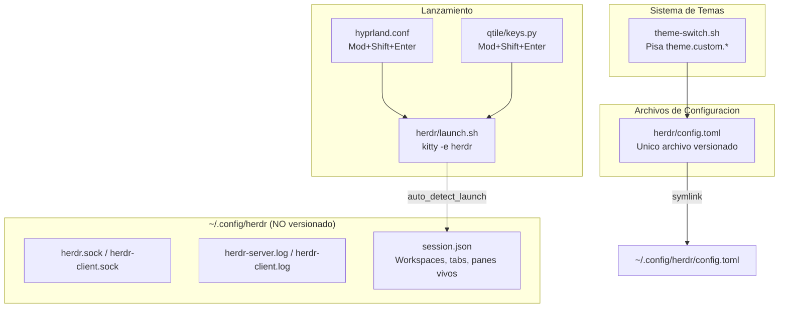

# Herdr -- Multiplexor de agentes de IA

## Que es

Multiplexor de terminal (tipo tmux) pensado para agentes de codificacion en terminal (Claude Code, Codex, etc.). Un servidor en background posee los procesos de terminal reales; los clientes se conectan/desconectan sin matar nada. Reconoce el estado de cada agente (`working`, `blocked`, `done`, `idle`, `unknown`) y prioriza interaccion con mouse.

## Diagrama de Arquitectura

## Por que solo se symlinkea `config.toml`

`~/.config/herdr/` mezcla configuracion con estado de runtime en vivo: sockets del servidor, logs y `session.json` (workspaces/tabs/panes activos). Symlinkear el directorio completo meteria ese estado dentro del repo de dotfiles. Por eso el patron acá es distinto al resto de los componentes: solo `~/.config/herdr/config.toml` es un symlink a `dotfiles/herdr/config.toml` — el resto del directorio queda intacto como estado local de la maquina.

## Prefix

Prefix custom: **`ctrl+space`** (el default de Herdr es `ctrl+b`, se cambio para no chocar con los bindings de Kitty `ctrl+shift+*` ni con Qtile `mod4`).

## Lanzamiento

`Mod + Shift + Enter` (identico en Hyprland y Qtile) ejecuta `herdr/launch.sh`, que corre `kitty --title herdr -e herdr`. El binario de Herdr detecta solo si ya hay un servidor corriendo (`auto_detect_launch()`) y se conecta a el, o arranca uno nuevo si no hay ninguno — no hace falta logica de attach propia.

## Configuracion Principal (`herdr/config.toml`)

| Seccion | Contenido |
|---------|-----------|
| `[keys]` | `prefix = "ctrl+space"`, navegacion de tabs/paneles, comando custom `prefix+alt+g` -> popup con `lazygit` |
| `[theme]` | `name = "terminal"` (tema base incorporado; Herdr no acepta nombres de tema arbitrarios) |
| `[theme.custom]` | Overrides de color sobre el tema base — actualizados por `theme-switch.sh` en cada `theme <nombre>` |
| `[terminal]` | Shell/cwd por defecto |
| `[ui]` | Posicion de la tab bar, toasts |

Ver atajos completos en [keybindings.md](../keybindings.md#herdr----multiplexor-de-agentes-dentro-de-la-sesion).

## Integracion con el sistema de temas

`scripts/theme-switch.sh` pisa `sidebar_bg`, `active_row_bg`, `selection_bg`, `accent` y `blue` en `[theme.custom]` con los colores del `theme.json` activo (`background`, `chip_battery`, `secondary`, `primary`, `chip_wlan`), y llama a `herdr server reload-config` en `reload_components()` para aplicarlos sin reiniciar la sesion.

> **Nota:** `theme.name` sigue fijo en `"terminal"` — Herdr valida el nombre contra una lista cerrada de temas incorporados (`catppuccin`, `nord`, `tokyo-night`, `gruvbox`, `one-dark`, etc.), no soporta un tema con nombre propio. Solo los colores de `[theme.custom]` son dinamicos.

## Diagnostico

| Problema | Comando |
|----------|---------|
| Agente no detectado | `herdr agent list` y `herdr agent explain <target> --json` |
| Config invalida tras editar | `herdr server reload-config` — devuelve `diagnostics` con las claves invalidas |
| Parar el servidor por completo | `herdr server stop` |
| Ver config activa resuelta | `herdr --default-config` (defaults) vs `herdr/config.toml` (overrides) |

**Docs oficiales:** https://herdr.dev/docs/
