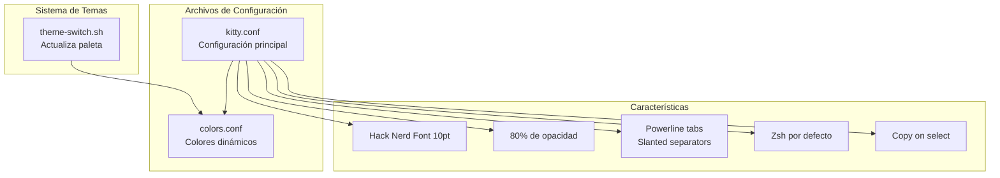

# Kitty -- Terminal

## Diagrama de Arquitectura

## Archivos

| Archivo | Rol | Características Clave |
|---------|-----|----------------------|
| `kitty.conf` | Configuración principal | Font, opacidad, tabs, atajos de teclado |
| `colors.conf` | Paleta de colores | Actualizado dinámicamente por theme-switch.sh |

**Ubicacion**: `kitty/`

## Configuracion Visual

- **Font**: Hack Nerd Font 10pt
- **Opacidad**: 80% de fondo
- **Tabs**: Powerline style con slanted separators
- **Shell**: Zsh por defecto
- **Copy on select**: Seleccionar texto lo copia automaticamente

## Atajos de Teclado

| Atajo | Accion |
|-------|--------|
| `Ctrl+Shift+Enter` | Nueva tab |
| `Ctrl+Shift+W` | Cerrar tab |
| `Ctrl+Shift+N` | Renombrar tab |
| `Ctrl+Shift+Space` | Nueva ventana (split) |
| `Ctrl+Shift+Left` | Resize narrower 5px |
| `Ctrl+Shift+Right` | Resize wider 5px |
| `Ctrl+Shift+Up` | Resize taller 5px |
| `Ctrl+Shift+Down` | Resize shorter 5px |

## Colores

Los colores se cargan desde `colors.conf`, que es actualizado dinamicamente por el sistema de temas (`theme-switch.sh`). Cada tema define su propia paleta de colores para kitty.
