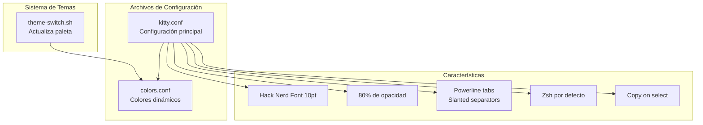

# Kitty -- Terminal

## Diagrama de Arquitectura

## Archivos

| Archivo | Rol | Características Clave |
|---------|-----|----------------------|
| `kitty.conf` | Configuración principal | Font, opacidad, tabs, atajos de teclado, `linux_display_server wayland` |
| `colors.conf` | Paleta de colores | Actualizado dinámicamente por theme-switch.sh |

**Ubicacion**: `kitty/`

## Configuracion Visual

- **Font**: Hack Nerd Font 10pt
- **Opacidad**: 80% de fondo
- **Wayland**: Soporte nativo via `linux_display_server wayland` en kitty.conf
- **Tabs**: Powerline style con slanted separators
- **Shell**: Zsh por defecto
- **Copy on select**: Seleccionar texto lo copia automaticamente

## Atajos de Teclado

| Atajo | Accion |
|-------|--------|
| `Ctrl+Shift+Enter` | Nueva tab |
| `Ctrl+Shift+W` | Cerrar tab |
| `Ctrl+Shift+N` | Renombrar tab |
| `Ctrl+Shift+Space` | Nueva ventana (split) |
| `Ctrl+Shift+Left` | Resize narrower 5px |
| `Ctrl+Shift+Right` | Resize wider 5px |
| `Ctrl+Shift+Up` | Resize taller 5px |
| `Ctrl+Shift+Down` | Resize shorter 5px |

## Colores

Los colores se cargan desde `colors.conf`, que es actualizado dinamicamente por el sistema de temas (`theme-switch.sh`). Cada tema define su propia paleta de colores para kitty.

### Variables de Color en colors.conf

| Variable | Propósito | Fuente en theme.json |
|----------|-----------|---------------------|
| `foreground` | Color de texto | `foreground` |
| `background` | Color de fondo | `background` |
| `cursor` | Color del cursor | `primary` |
| `cursor_text_color` | Color del texto bajo el cursor | `background` |
| `selection_background` | Fondo de selección | `secondary` |
| `selection_foreground` | Texto de selección | `#ffffff` (fijo) |
| `active_tab_foreground` | Texto de tab activa | `#ffffff` (fijo) |
| `active_tab_background` | Fondo de tab activa | `secondary` |
| `inactive_tab_foreground` | Texto de tabs inactivas | `#888888` (fijo) |
| `inactive_tab_background` | Fondo de tabs inactivas | `#1a1a1a` (fijo) |
| `tab_bar_background` | Fondo de la barra de tabs | `background` |
| `tab_bar_margin_color` | Margen de la barra de tabs | `background` |
| `url_color` | Color de enlaces clickeables | `primary` |
| `url_style` | Estilo de subrayado de enlaces | `curly` (fijo) |
| `active_border_color` | Borde de ventana activa | `primary` |
| `inactive_border_color` | Borde de ventana inactiva | `#444444` (fijo) |
| `bell_border_color` | Borde al recibir bell | `secondary` |
| `statusbar_fg` | Texto de la barra de estado | `foreground` |
| `statusbar_bg` | Fondo de la barra de estado | `background` |

### Notas

- `cursor_text_color` se setea al valor de `background` para que el cursor se vea como un bloque sólido del color primary con texto en color de fondo.
- `url_style` está fijo en `curly`; `url_color` usa el primary del tema.
- Los colores de tabs (`active_tab_*`, `inactive_tab_*`, `tab_bar_*`) permiten que el tab bar se integre visualmente con el fondo de la terminal.
- `statusbar_fg` y `statusbar_bg` aplican a la barra de estado inferior de Kitty (si está habilitada).
