# Picom -- Compositor (X11 only)

## Overview

Picom es el compositor utilizado exclusivamente en el backend X11. En **Wayland** no es necesario: el compositor wlroots de Qtile maneja el rendering, vsync, y transparencias nativamente.

## Diagrama de Arquitectura

```mermaid
graph TB
    subgraph Config["Archivo de Configuración"]
        PC[picom.conf]
    end

    subgraph Settings["Ajustes Principales"]
        BK[Backend: GLX]
        VS[Vsync: true]
        CR[Corner Radius: 12px]
        BL[Blur: dual_kawase<br/>Strength 6]
        SH[Shadows: Deshabilitados]
        FD[Fade: 200ms]
    end

    subgraph Opacity["Reglas de Opacidad"]
        RO[Rofi: 75%]
        PB[Polybar: 100%]
        QT[Qtile: 100%]
        KT[Kitty: 70%]
        ST[Sublime Text: 75%]
        OB[Obsidian: 65%]
    end

    subgraph Exclusions["Exclusiones de Bordes"]
        DOC[Docks]
        DES[Escritorio]
        POL[Polybar]
        DM[Dmenu]
    end

    PC --> BK
    PC --> VS
    PC --> CR
    PC --> BL
    PC --> SH
    PC --> FD
    PC --> RO
    PC --> PB
    PC --> QT
    PC --> KT
    PC --> ST
    PC --> OB
    PC --> DOC
    PC --> DES
    PC --> POL
    PC --> DM
```

## Tabla de Opacidad

| Ventana | Opacidad |
|---------|----------|
| Rofi | 75% |
| Polybar | 100% |
| Qtile | 100% |
| Kitty | 70% |
| Sublime Text | 75% |
| Obsidian | 65% |

**Ubicacion**: `picom/picom.conf`

## Configuracion

| Parametro | Valor |
|-----------|-------|
| Backend | GLX |
| Vsync | true |
| Corner radius | 12px |
| Blur | dual_kawase (strength 6) |
| Shadows | Deshabilitados |
| Fade | true, 200ms transition |

## Opacity Rules

Ventanas con opacidad reducida:

| Ventana | Opacidad |
|---------|----------|
| Rofi | 75% |
| Polybar | 100% |
| Qtile | 100% |
| Kitty | 70% |
| Sublime Text | 75% |
| Obsidian | 65% |

## Exclusiones de Bordes Redondeados

No aplica border radius a:
- Docks
- Escritorio
- Polybar
- dmenu
- Dunst

## Efectos

- **Blur dual_kawase**: Desenfoque de fondo con calidad media/alta
- **Fade**: Transiciones suaves de 200ms al abrir/cerrar/mapear ventanas
- **Sin sombras**: Estilo plano y limpio

## Wayland

En Wayland, Picom no se ejecuta. El compositor wlroots de Qtile maneja:
- Vsync
- Opacidad de ventanas (Kitty maneja su propia transparencia)
- Sin blur de fondo ni esquinas redondeadas globales

Si se desea blur y esquinas redondeadas en Wayland, considerar migrar a Hyprland (que lo soporta nativamente).
