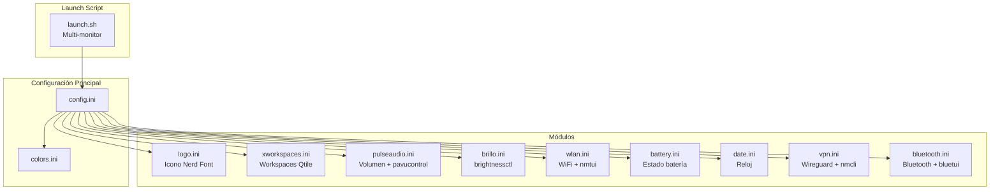

# Polybar -- Status Bar

## Diagrama de Arquitectura



## Tabla de Módulos

| Archivo | Rol | Características Clave |
|---------|-----|----------------------|
| `config.ini` | Configuración principal | 98% ancho, 28px, top, esquinas redondeadas 10px |
| `colors.ini` | Paleta de colores | Actualizado por theme-switch dinámicamente |
| `launch.sh` | Script de inicio | Mata instancias previas, lanza barra por monitor |
| `logo.ini` | Logo + menú | Icono Nerd Font, click abre settings-menu en rofi |
| `xworkspaces.ini` | Workspaces | Estados: focused, occupied, urgent, empty |
| `pulseaudio.ini` | Volumen | Icono 󰕾, mute, click abre pavucontrol |
| `brillo.ini` | Brillo | Icono 󰃃, scroll para ajustar vía brightnessctl |
| `wlan.ini` | WiFi | Icono 󰤨/󰤮, click abre nmtui |
| `battery.ini` | Batería | Estados charging / discharging / low |
| `date.ini` | Reloj | Mon 14:30, alt muestra fecha completa |
| `vpn.ini` | VPN | Icono 󰦝/󰦞, chequea ARCH-CH-US-3, click togglea |
| `bluetooth.ini` | Bluetooth | On/off icon, click abre bluetui en kitty |

**Ubicacion**: `polybar/`

## Estructura

```
polybar/
├── config.ini        # Configuracion principal de la barra
├── colors.ini        # Colores (actualizados por theme-switch)
├── launch.sh         # Script de inicio por monitor
└── modules/
    ├── battery.ini
    ├── bluetooth.ini
    ├── bluetooth_status.sh
    ├── brillo.ini
    ├── date.ini
    ├── logo.ini
    ├── pulseaudio.ini
    ├── vpn.ini
    ├── vpn_status.sh
    ├── vpn_toggle.sh
    ├── wlan.ini
    └── xworkspaces.ini
```

## Barra Principal

- **Ancho**: 98% de la pantalla
- **Altura**: 28px
- **Esquinas**: Redondeadas (10px radius)
- **Posicion**: Top
- **Modulos**: Logo (izquierda) | Workspaces (centro) | System Tray + Fecha + Audio + Brillo + Red + VPN + Bluetooth + Bateria (derecha)

## Modulos

| Modulo | Descripcion |
|--------|-------------|
| `logo.ini` | Icono Nerd Font (󰣇) en color primary, click abre settings-menu (rofi) |
| `xworkspaces.ini` | Labels de workspaces Qtile con estados: focused, occupied, urgent, empty |
| `pulseaudio.ini` | Volumen (󰕾), mute state, click abre pavucontrol |
| `brillo.ini` | Brillo (󱠃) via brightnessctl, scroll para ajustar |
| `wlan.ini` | WiFi (󰤨/󰤮), click abre nmtui |
| `battery.ini` | Bateria con charging/discharging/low states |
| `date.ini` | Reloj + dia de semana (Mon 14:30), alt muestra fecha completa con dia (Monday 2024-01-15 14:30:00) |
| `vpn.ini` | VPN (󰦝/󰦞) via `nmcli`, chequea ARCH-CH-US-3, click togglea conexion |
| `bluetooth.ini` | Bluetooth on/off icon, click abre bluetui en kitty |

## Launch Script

`launch.sh` mata instancias previas de polybar y lanza una barra por monitor detectado via xrandr.
