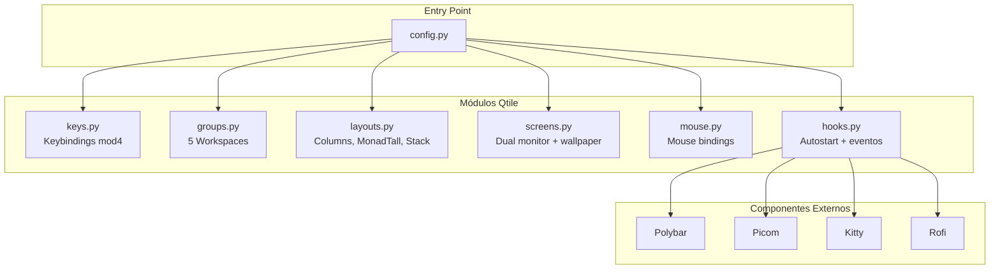

# Qtile -- Window Manager

## Diagrama de Arquitectura



## Tabla de Módulos

| Archivo | Rol | Características Clave |
|---------|-----|----------------------|
| `config.py` | Entry point | Punto de entrada, importa todos los módulos |
| `groups.py` | Workspaces | 5 workspaces (NOTES, FILES, DEV, SYS, WEB) |
| `keys.py` | Keybindings | Atajos de teclado con mod4 |
| `layouts.py` | Layouts | Columns, MonadTall, Stack + reglas flotación |
| `screens.py` | Pantallas | Dual monitor, wallpaper desde tema |
| `mouse.py` | Mouse | Bindings de ratón |
| `hooks.py` | Eventos | Autostart de polybar, picom, kitty, rofi |

**Ubicacion**: `qtile/`

## Estructura Modular

```
qtile/
├── config.py                  # Entry point
├── current_theme.json         # Tema activo
└── modules/
    ├── groups.py              # Workspace definitions
    ├── keys.py                # Keybindings
    ├── layouts.py             # Layouts y reglas
    ├── mouse.py               # Mouse bindings
    ├── screens.py             # Pantallas y wallpapers
    └── hooks.py               # Autostart y eventos
```

## Workspaces (Groups)

5 workspaces definidos en `groups.py`:

| # | Nombre | Icono | Proposito |
|---|--------|-------|-----------|
| 1 | NOTES | 󰠮 | Notas, documentacion |
| 2 | FILES | 󰉋 | Gestion de archivos |
| 3 | DEV | 󰘦 | Desarrollo / coding |
| 4 | SYS | 󰣇 | Sistema, terminales |
| 5 | WEB | 󰖟 | Navegador, web |

## Layouts

Tres layouts configurados en `layouts.py`:

- **Columns**: Ventanas en columnas verticales
- **MonadTall**: Layout principal con master a izquierda y stack a derecha
- **Stack**: Ventanas apiladas

Las reglas de flotacion incluyen: `confirmreset`, `xdman`, `Xephyr`, `firefox-config-qt`, `About.*`, `gnome-keyring-prompt`, `pavucontrol`, `arandr`, `obsidian`, `Lxappearance`, `xfce4-*`.

## Screens

Configuracion de pantallas en `screens.py`:

- **Dual monitor**: Laptop + externo
- **Wallpaper**: Cargado desde el tema activo via `qtile/current_theme.json`
- **Barra**: Polybar se maneja aparte (no desde Qtile)

## Hooks (Autostart)

En `hooks.py`, al iniciar Qtile:

1. `nitrogen --restore` -- wallpaper
2. `~/.config/polybar/launch.sh` -- barra de estado
3. `picom --config ~/.config/picom/picom.conf` -- compositor
4. Configuracion de monitores para multi-screen

## Atajos

Ver [Keybindings](../keybindings.md) para la lista completa de shortcuts.
