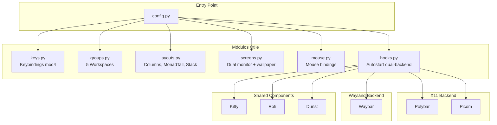

# Qtile -- Window Manager

## Dual-Backend

Qtile 0.36+ soporta tanto X11 como Wayland nativamente. El backend se selecciona al iniciar sesión:

- **Qtile** (LightDM) → X11
- **Qtile (Wayland)** (LightDM) → Wayland

El autostart en `hooks.py` detecta automáticamente el backend via `WAYLAND_DISPLAY` y arranca los componentes correspondientes.

## Diagrama de Arquitectura



## Tabla de Módulos

| Archivo | Rol | Características Clave |
|---------|-----|----------------------|
| `config.py` | Entry point | Punto de entrada, importa todos los módulos, config Wayland (`wl_input_rules`, `wl_xcursor_*`) |
| `groups.py` | Workspaces | 5 workspaces (NOTES, FILES, DEV, SYS, WEB) |
| `keys.py` | Keybindings | Atajos de teclado con mod4, scripts con detección de backend |
| `layouts.py` | Layouts | Columns, MonadTall, Stack + reglas flotación |
| `screens.py` | Pantallas | Dual monitor, wallpaper desde tema (funciona en X11 y Wayland) |
| `mouse.py` | Mouse | Bindings de ratón |
| `hooks.py` | Eventos | Autostart dual-backend (Waybar/Wayland vs Polybar+Picom/X11) |

**Ubicacion**: `qtile/`

## Estructura Modular

```
qtile/
├── config.py                  # Entry point
├── current_theme.json         # Tema activo
└── modules/
    ├── groups.py              # Workspace definitions
    ├── keys.py                # Keybindings
    ├── layouts.py             # Layouts y reglas
    ├── mouse.py               # Mouse bindings
    ├── screens.py             # Pantallas y wallpapers
    └── hooks.py               # Autostart dual-backend
```

## Workspaces (Groups)

5 workspaces definidos en `groups.py`:

| # | Nombre | Icono | Proposito |
|---|--------|-------|-----------|
| 1 | NOTES | 󰠮 | Notas, documentacion |
| 2 | FILES | 󰉋 | Gestion de archivos |
| 3 | DEV | 󰘦 | Desarrollo / coding |
| 4 | SYS | 󰣇 | Sistema, terminales |
| 5 | WEB | 󰖟 | Navegador, web |

## Layouts

Tres layouts configurados en `layouts.py`:

- **Columns**: Ventanas en columnas verticales
- **MonadTall**: Layout principal con master a izquierda y stack a derecha
- **Stack**: Ventanas apiladas

## Screens

Configuracion de pantallas en `screens.py`:

- **Dual monitor**: Laptop + externo
- **Wallpaper**: Cargado desde el tema activo (funciona en X11 y Wayland)
- **Barra**: Polybar (X11) o Waybar (Wayland) se manejan aparte

### Wallpaper durante cambio de temas

Al ejecutar `theme <nombre>`, el wallpaper se aplica de forma optimizada sin recargar todo Qtile:

1. **X11**: `theme-switch.sh` ejecuta `feh --bg-fill` — método directo que escribe en `_XROOTMAP_ID`, independiente de Qtile (~50ms). Si `feh` no está instalado, usa `qtile cmd-obj -o screen N -f set_wallpaper` que aplica solo el wallpaper sin recargar la config completa.
2. **Wayland**: `theme-switch.sh` ejecuta `qtile cmd-obj -o screen N -f set_wallpaper` directamente. Qtile Wayland implementa `set_wallpaper` usando Cairo + wlr-layer-shell, pintando el wallpaper en vivo sin necesidad de recargar la configuración completa (~200ms). No requiere reload ni logout.

**Ver**: `scripts/theme-switch.sh` → `_set_wallpaper_direct()`

## Hooks (Autostart)

En `hooks.py`, al iniciar Qtile se detecta el backend:

**Wayland:**
1. `~/.config/waybar/launch.sh` -- Waybar
2. `dunst` -- notificaciones

**X11:**
1. `xset s off` + `xset -dpms` -- desactivar DPMS
2. `nitrogen --restore` -- wallpaper
3. `~/.config/polybar/launch.sh` -- Polybar
4. `picom` -- compositor
5. `dunst` -- notificaciones

## Configuración Wayland

En `config.py`:

```python
wl_input_rules = [
    ("type:keyboard", {"xkb_layout": "es"}),
]
wl_xcursor_theme = "Adwaita"
wl_xcursor_size = 24
```

## Atajos

Ver [Keybindings](../keybindings.md) para la lista completa de shortcuts.
