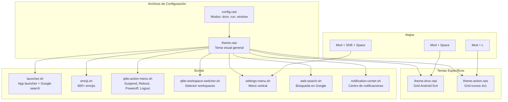

# Rofi -- Application Launcher

## Diagrama de Arquitectura

## Archivos

| Archivo | Rol | Características Clave |
|---------|-----|----------------------|
| `config.rasi` | Configuración de modos | drun, run, window, fuzzy matching fzf-style |
| `theme.rasi` | Tema visual general | Norte, 480px, border-radius 24px, fondo oscuro |
| `theme-drun.rasi` | Grid app launcher | 5 columnas x 4 filas, iconos 36px, 680px ancho |
| `theme-action.rasi` | Grid acciones | 4 columnas x 1 fila, icono + texto, 520px ancho |
| `favoritos.txt` | Apps favoritas | Lista de aplicaciones favoritas |
| `scripts/` | Scripts extendidos | Launcher, emoji, acciones, workspaces, settings, web, notificaciones |

**Ubicacion**: `rofi/`

## Configuracion

- **Modos**: drun (apps instaladas), run (comandos), window (ventanas activas)
- **Sort**: fzf-style fuzzy matching
- **Iconos**: Habilitados en las entradas

## Tema Action (Grid Iconos)

`theme-action.rasi` se usa para el menu de acciones (`Mod+L`):

- **Grid**: 4 columnas x 1 fila, icono arriba + texto abajo
- **Window**: centrado, 520px de ancho
- **Acciones**: Suspend, Reboot, Poweroff, Logout

## Tema Drun (Android Grid)

`theme-drun.rasi` se usa exclusivamente para el app launcher (`Mod+Space`):

- **Grid**: 5 columnas x 4 filas
- **Layout**: icono arriba, texto abajo (vertical)
- **Window**: centrado, 680px de ancho
- **Iconos**: 36px

## Tema General

- **Posicion**: Norte (top)
- **Ancho**: 480px
- **Border radius**: 24px
- **Fondo**: Oscuro semi-transparente
- **Font**: Nerd Font para iconos
- **Elementos**: Esquinas redondeadas en todos los componentes

## Scripts

| Script | Descripcion |
|--------|-------------|
| `spotlight-launch.sh` | Buscador único (`combi`: drun+run+fallback) — reemplazó a `launcher.sh` (retirado) |
| `spotlight-fallback.sh` | Catch-all de texto sin match en el buscador: comando → calculadora (`bc`/`python3`) → búsqueda web |
| `emoji.sh` | Emoji picker (800+ emojis), copia al portapapeles |
| `qtile-action-menu.sh` | Acciones del sistema: Suspend, Reboot, Poweroff, Logout |
| `qtile-workspace-switcher.sh` | Selector de workspaces (ícono + Workspace N) |
| `settings-menu.sh` | Menu central: Themes, Workspaces, Apps, Web search, Backgrounds |
| `web-search.sh` | Busqueda en Google, abre Firefox en workspace 5 |

## Acceso

- `Mod + Space` -- Buscador único (lista vertical, 5 filas en reposo — ver nota de Hyprland abajo)
- `Mod + L` -- Action menu (suspend/reboot/poweroff/logout)
- `Mod + Shift + Space` -- Settings menu

**Nota — Hyprland usa Walker, no esto**: en Hyprland, `Mod+Space` abre
[Walker+Elephant](walker.md) en vez de este buscador de rofi (soporta
resultados 100% en vivo y arranca vacío, algo que rofi no puede hacer — ver
`docs/design-system.md`). Este `spotlight-launch.sh` sigue siendo el
buscador real en **Qtile/X11** (`qtile/modules/keys.py`), donde Walker no
puede correr (depende de `gtk4-layer-shell`, Wayland-only).

## Integración con theme-switch.sh

`rofi/colors.rasi` (nuevo, `@import`ado por `theme.rasi`/`theme-drun.rasi`/
`theme-action.rasi` — antes cada uno duplicaba su propia paleta) se
regenera en cada `theme <nombre>`: `bg0..bg3` = rampa `chip_battery` →
`chip_audio` (con los mismos sufijos de alfa que ya se usaban), `fg0..fg3`
= `foreground` y blends. Radio unificado a 10px en los 3 temas (antes
16-24px según el archivo), `inputbar` sin borde (regla Flat Minimal). No
hace falta reload — rofi lee el archivo cada vez que se abre.
