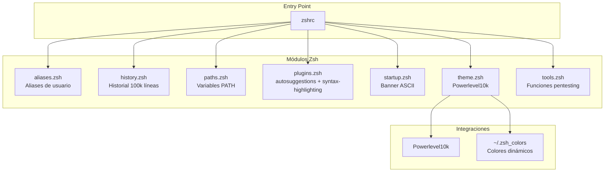

# Zsh -- Shell

## Diagrama de Arquitectura



## Tabla de Módulos

| Archivo | Rol | Características Clave |
|---------|-----|----------------------|
| `zshrc` | Entry point | Punto de entrada, importa todos los módulos |
| `aliases.zsh` | Aliases | theme, vi, cat (bat), ls (lsd), vpnup/vpndown, .. / ... |
| `history.zsh` | Historial | 100k líneas, compartido entre sesiones, incremental, dedup |
| `paths.zsh` | PATH | Agrega ~/.local/bin, ~/.opencode/bin |
| `plugins.zsh` | Plugins | zsh-autosuggestions, zsh-syntax-highlighting |
| `startup.zsh` | Banner | Muestra "D4rkDr4g0n" en ASCII rojo al abrir terminal |
| `theme.zsh` | Prompt | Powerlevel10k, instant prompt, colores desde ~/.zsh_colors |
| `tools.zsh` | Pentesting | extractPorts, hex-encode/decode, rot13 |

**Ubicacion**: `zsh/`

## Estructura Modular

```
zsh/
├── zshrc                # Entry point
└── modules/
    ├── aliases.zsh      # Aliases de usuario
    ├── history.zsh      # Configuracion de historial
    ├── paths.zsh        # Variables PATH
    ├── plugins.zsh      # Plugins (autosuggestions, syntax-highlighting)
    ├── startup.zsh      # Banner de inicio
    ├── theme.zsh        # Powerlevel10k prompt
    └── tools.zsh        # Funciones de pentesting
```

## Modulos

### aliases.zsh

Aliases principales:

- `theme` -- Cambiar tema (wrapper de `theme-switch.sh`)
- `vi` -- Neovim
- `cat` -- `bat` (con syntax highlighting)
- `ls`/`l`/`ll`/`la`/`lla` -- `lsd` con icons
- `c` -- `clear`
- `q` -- `exit`
- `..`/`...`/`....`/`.....` -- Navegacion rapida
- `top` -- `btop`
- `vpnup` -- `nmcli connection up ARCH-CH-US-3` (conectar Wireguard VPN)
- `vpndown` -- `nmcli connection down ARCH-CH-US-3` (desconectar Wireguard VPN)
- `vpnreplace` -- `sh ~/dotfiles/scripts/vpn-replace.sh <archivo.conf>` (legacy: rotar
  servidor Proton con `sed` sobre docs/aliases; reemplazado por la tab
  ProtonVPN de `vpn_tui.py`, que importa `.conf` a NetworkManager sin tocar
  archivos. Ver [Keybindings](../keybindings.md#red--vpn))

Lista completa en [Keybindings](../keybindings.md).

### history.zsh

- **Tamano**: 100k lineas
- **Compartido**: Entre sesiones simultaneas
- **Incremental**: `inc_append` para escritura inmediata
- **Dedup**: Ignora duplicados y comandos con espacios al inicio

### paths.zsh

Agrega al PATH:
- `~/.local/bin`
- `~/.opencode/bin`

### plugins.zsh

- `zsh-autosuggestions` -- Autocompletado basado en historial
- `zsh-syntax-highlighting` -- Coloreado de comandos en tiempo real

### startup.zsh

Muestra un banner ASCII rojo con "D4rkDr4g0n" y el nombre de usuario al abrir terminal.

### theme.zsh

- Carga **Powerlevel10k** con configuracion instant prompt
- Importa colores dinamicos desde `~/.zsh_colors` (actualizado por tema)
- Prompt personalizado con informacion de git, tiempo, y estado

### tools.zsh

Funciones de pentesting:

| Funcion | Descripcion |
|---------|-------------|
| `extractPorts` | Extrae puertos de escaneos y los copia al clipboard |
| `hex-encode` | Codifica string a hexadecimal |
| `hex-decode` | Decodifica hexadecimal a string |
| `rot13` | Aplica cifrado ROT13 |
