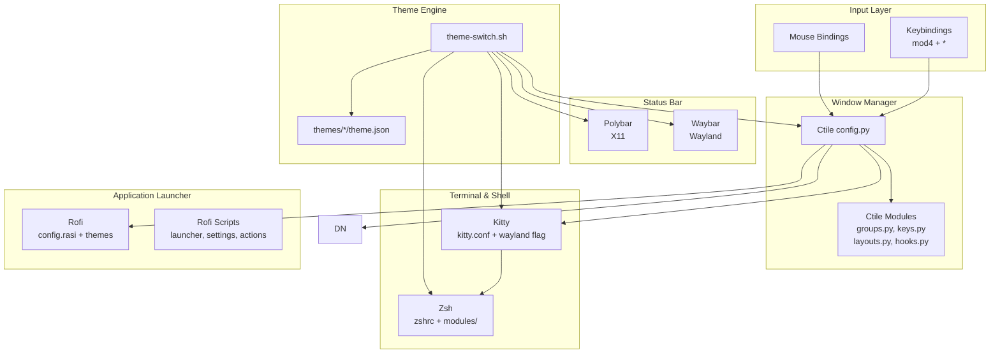
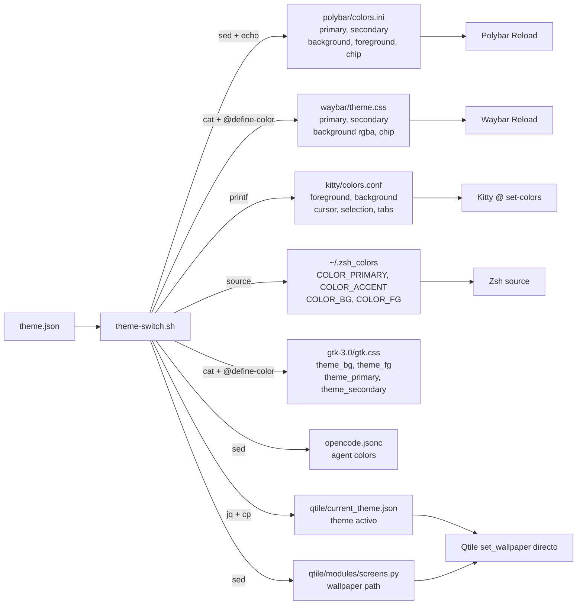

# Overview

## Core Philosophy

El entorno se sostiene sobre tres pilares fundamentales:

- **Keyboard-driven**: Control total del entorno via atajos de teclado. El mouse es opcional. Las combinaciones `mod4` (Super) gobiernan ventanas, workspaces, lanzadores y menus.
- **Estetica unificada**: Tema cyberpunk oscuro con acentos rojos, transparencias y blur. Consistente en todos los componentes. Funciona igual en X11 y Wayland.
- **Modularidad**: Cada componente es independiente y facil de modificar. El sistema de temas dinamicos permite cambiar la apariencia completa con un solo comando. Soporte dual-backend (X11/Wayland).

## Component Architecture

### Dual-Backend

Qtile 0.36+ soporta Wayland nativamente. El autostart detecta automáticamente el backend y arranca los componentes correspondientes:

| Componente | X11 | Wayland |
|---|---|---|
| **Barra** | Polybar | Waybar (misma estética) |
| **Compositor** | Picom (GLX + blur) | No necesario (wlroots) |
| **Wallpaper** | Nitrogen | Qtile `Screen(wallpaper=...)` |
| **Lock** | betterlockscreen | gtklock (CSS custom + grim + ImageMagick) |
| **Screenshot** | Flameshot | grim + slurp |
| **Monitores** | xrandr | wlr-randr |

Ver [Wayland Architecture](configuration/wayland.md) para el detalle completo.



**Sources:** `qtile/config.py`, `polybar/config.ini`, `waybar/config.jsonc`, `kitty/kitty.conf`, `zsh/zshrc`, `scripts/theme-switch.sh`, `scripts/barupdate.sh`

## Component Table

| Componente | Proposito | Configuracion | Docs |
|------------|-----------|---------------|------|
| **Ctile** | Window Manager (tiling, dual-backend) | `qtile/` | [docs](configuration/qtile.md) |
| **Polybar** | Barra de estado (X11) | `polybar/` | [docs](configuration/polybar.md) |
| **Waybar** | Barra de estado (Wayland) | `waybar/` | [docs](configuration/wayland.md) |
| **Kitty** | Terminal emulator (X11 + Wayland) | `kitty/` | [docs](configuration/kitty.md) |
| **Zsh** | Shell + prompt (powerlevel10k) | `zsh/` | [docs](configuration/zsh.md) |
| **Rofi** | Application launcher & menus | `rofi/` | [docs](configuration/rofi.md) |
| **Picom** | Compositor (X11 only) | `picom/` | [docs](configuration/picom.md) |
| **Dunst** | Notification daemon | `dunst/` | [docs](configuration/dunst.md) |
| **Neovim** | Editor (LazyVim) | `lazy-nvim/` | [docs](configuration/editors.md) |
| **Sublime Text** | Editor alternativo | `sublime-text/` | [docs](configuration/editors.md) |
| **Thunar** | File manager | `Thunar/` | [docs](configuration/thunar.md) |
| **Fastfetch** | System info display | `fastfetch/` | [docs](configuration/fastfetch.md) |
| **OneDrive** | Cloud sync | `onedrive/` | [docs](configuration/extras.md) |
| **GTK3** | Tema GTK base + CSS dinámico (Thunar, apps GTK3) | `gtk-3.0/` | [docs](configuration/gtk.md) |
| **Lock Screen** | gtklock (Wayland) / betterlockscreen (X11) | `gtklock/` + `scripts/` | [docs](configuration/lock-screen.md) |
| **opencode** | AI assistant config + skills | `opencode/` | [docs](configuration/opencode.md) |
| **Screenshots** | grim+slurp (Wayland) / Flameshot (X11) | `scripts/screenshot.sh` | [docs](configuration/wayland.md) |

## Symlink Structure

Los archivos de configuracion se vinculan desde el repo a sus ubicaciones del sistema via symlinks, permitiendo gestion centralizada desde `~/dotfiles`:

| System Path | Repository Target |
|-------------|-------------------|
| `~/.zshrc` | `~/dotfiles/zsh/zshrc` |
| `~/.config/qtile` | `~/dotfiles/qtile/` |
| `~/.config/polybar` | `~/dotfiles/polybar/` |
| `~/.config/waybar` | `~/dotfiles/waybar/` |
| `~/.config/gtklock` | `~/dotfiles/gtklock/` |
| `~/.config/picom` | `~/dotfiles/picom/` |
| `~/.config/rofi` | `~/dotfiles/rofi/` |
| `~/.config/kitty` | `~/dotfiles/kitty/` |
| `~/.config/Thunar` | `~/dotfiles/Thunar/` |
| `~/.config/zsh` | `~/dotfiles/zsh/` |
| `~/.config/automat` | `~/dotfiles/automat/` |
| `~/.config/dunst` | `~/dotfiles/dunst/` |
| `~/.config/opencode` | `~/dotfiles/opencode/` |
| `~/.config/nvim` | `~/dotfiles/lazy-nvim/` |
| `~/.config/gtk-3.0/settings.ini` | `~/dotfiles/gtk-3.0/settings.ini` |

## Theme Data Flow

Cada tema define colores para todos los componentes. El sistema de temas genera configuraciones tanto para X11 (Polybar) como para Wayland (Waybar) simultáneamente:



**Sources:** `scripts/theme-switch.sh:62-141`, `polybar/colors.ini`, `waybar/theme.css`, `kitty/colors.conf`, `zsh/modules/theme.zsh`, `gtk-3.0/`, `opencode/opencode.jsonc`, `qtile/current_theme.json`

## File Tree

```
dotfiles/
├── README.md
├── docs/
│   ├── overview.md
│   ├── installation.md
│   ├── keybindings.md
│   ├── themes.md
│   ├── automations.md
│   └── configuration/
│       ├── qtile.md, polybar.md, wayland.md, kitty.md, zsh.md, rofi.md
│       ├── picom.md, dunst.md, editors.md, fastfetch.md
│       ├── thunar.md, gtk.md, opencode.md, extras.md, lock-screen.md
│
├── qtile/
├── polybar/
├── waybar/                    # Wayland bar (reemplaza Polybar en Wayland)
│   ├── config.jsonc
│   ├── style.css
│   ├── theme.css
│   ├── launch.sh
│   ├── modules/
│   └── scripts/
├── gtklock/                   # Wayland lock screen config (GTK-based)
│   ├── config.ini, style.css, layout.ui
├── kitty/
├── zsh/
├── rofi/
├── picom/
├── dunst/
├── lazy-nvim/
├── sublime-text/
├── Thunar/
├── fastfetch/
├── gtk-3.0/
│   └── settings.ini              # Tema GTK base (Matcha-dark-aliz, Papirus-Dark)
├── onedrive/
├── opencode/
├── themes/                    # 8 temas dinamicos
├── scripts/                   # theme-switch.sh, lock-screen.sh, barupdate.sh, screenshot.sh, vpn-replace.sh
├── automat/                   # Automatizacion + install scripts
└── recursos/                  # Wallpapers, ASCII, herramientas
```

## Navigation Guide

- [Instalacion](installation.md) — Deployment desde cero, flags, scripts individuales
- [Atajos de Teclado](keybindings.md) — Todos los shortcuts Qtile, Kitty, Thunar, Zsh
- [Temas](themes.md) — Sistema de temas dinamicos, creacion y personalizacion
- [Automatizaciones](automations.md) — Scripts de instalacion, vault, AI, utilities
- [Configuracion Ctile](configuration/qtile.md) — Window manager, grupos, layouts, hooks, dual-backend
- [Configuracion Polybar](configuration/polybar.md) — Barra de estado X11, modulos, colores
- [Wayland Architecture](configuration/wayland.md) — Migracion, dual-backend, Waybar, gtklock, grim+slurp
- [Configuracion Kitty](configuration/kitty.md) — Terminal, colores, keybindings, Wayland
- [Configuracion Zsh](configuration/zsh.md) — Shell, aliases, plugins, prompt
- [Configuracion Rofi](configuration/rofi.md) — Launcher, temas, scripts
- [Configuracion Picom](configuration/picom.md) — Compositor X11, blur, animaciones
- [Configuracion Dunst](configuration/dunst.md) — Notificaciones, notification center
- [Editores](configuration/editors.md) — Neovim (LazyVim) y Sublime Text
- [Fastfetch](configuration/fastfetch.md) — System info display
- [Thunar](configuration/thunar.md) — File manager, custom actions
- [GTK3](configuration/gtk.md) — Tema GTK base, CSS dinámico para Thunar y apps GTK
- [opencode](configuration/opencode.md) — AI assistant, skills personalizadas
- [Lock Screen](configuration/lock-screen.md) — gtklock / betterlockscreen, CSS custom, clock + banner
- [Extras](configuration/extras.md) — OneDrive, wallpapers, herramientas
