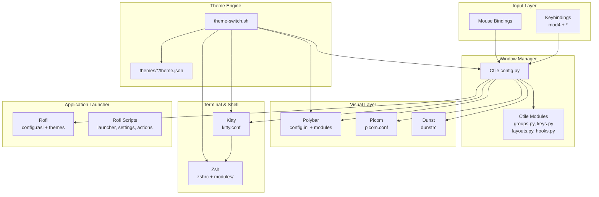
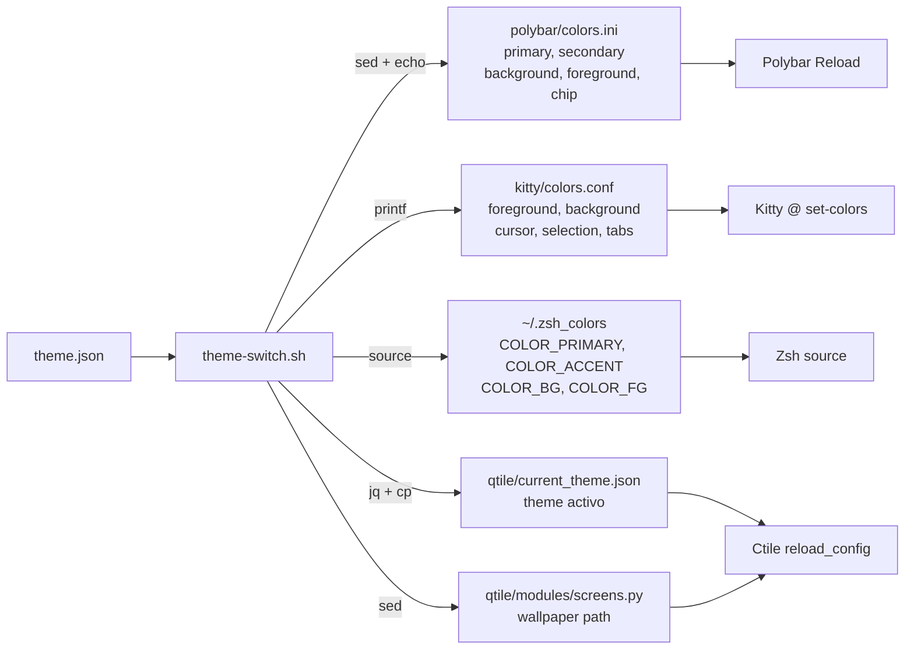

# Overview

## Core Philosophy

El entorno se sostiene sobre tres pilares fundamentales:

- **Keyboard-driven**: Control total del entorno via atajos de teclado. El mouse es opcional. Las combinaciones `mod4` (Super) gobiernan ventanas, workspaces, lanzadores y menus.
- **Estetica unificada**: Tema cyberpunk oscuro con acentos rojos, transparencias (80% Kitty, 85% Dunst via Picom) y blur (dual_kawase, radius 6). Consistente en todos los componentes.
- **Modularidad**: Cada componente es independiente y facil de modificar. El sistema de temas dinamicos permite cambiar la apariencia completa con un solo comando.

## Component Architecture

El siguiente diagrama muestra como los componentes principales se relacionan entre si y con el sistema de temas:



**Sources:** `qtile/config.py`, `polybar/config.ini`, `kitty/kitty.conf`, `zsh/zshrc`, `scripts/theme-switch.sh`

## Component Table

| Componente | Proposito | Configuracion | Docs |
|------------|-----------|---------------|------|
| **Ctile** | Window Manager (tiling) | `qtile/` | [docs](configuration/qtile.md) |
| **Polybar** | Barra de estado | `polybar/` | [docs](configuration/polybar.md) |
| **Kitty** | Terminal emulator | `kitty/` | [docs](configuration/kitty.md) |
| **Zsh** | Shell + prompt (powerlevel10k) | `zsh/` | [docs](configuration/zsh.md) |
| **Rofi** | Application launcher & menus | `rofi/` | [docs](configuration/rofi.md) |
| **Picom** | Compositor (blur, transparencias) | `picom/` | [docs](configuration/picom.md) |
| **Dunst** | Notification daemon | `dunst/` | [docs](configuration/dunst.md) |
| **Neovim** | Editor (LazyVim) | `lazy-nvim/` | [docs](configuration/editors.md) |
| **Sublime Text** | Editor alternativo | `sublime-text/` | [docs](configuration/editors.md) |
| **Thunar** | File manager | `Thunar/` | [docs](configuration/thunar.md) |
| **Fastfetch** | System info display | `fastfetch/` | [docs](configuration/fastfetch.md) |
| **OneDrive** | Cloud sync | `onedrive/` | [docs](configuration/extras.md) |
| **Lock Screen** | Custom C lockscreen | `scripts/lock-screen` | [docs](configuration/lock-screen.md) |
| **opencode** | AI assistant config + skills | `opencode/` | [docs](configuration/opencode.md) |

## Symlink Structure

Los archivos de configuracion se vinculan desde el repo a sus ubicaciones del sistema via symlinks, permitiendo gestion centralizada desde `~/dotfiles`:

| System Path | Repository Target |
|-------------|-------------------|
| `~/.zshrc` | `~/dotfiles/zsh/zshrc` |
| `~/.config/qtile` | `~/dotfiles/qtile/` |
| `~/.config/polybar` | `~/dotfiles/polybar/` |
| `~/.config/picom` | `~/dotfiles/picom/` |
| `~/.config/rofi` | `~/dotfiles/rofi/` |
| `~/.config/kitty` | `~/dotfiles/kitty/` |
| `~/.config/Thunar` | `~/dotfiles/Thunar/` |
| `~/.config/zsh` | `~/dotfiles/zsh/` |
| `~/.config/automat` | `~/dotfiles/automat/` |
| `~/.config/dunst` | `~/dotfiles/dunst/` |
| `~/.config/opencode` | `~/dotfiles/opencode/` |
| `~/.config/nvim` | `~/dotfiles/lazy-nvim/` |

## Theme Data Flow

Cada tema define colores para todos los componentes. El siguiente diagrama muestra como `theme-switch.sh` distribuye los valores desde `theme.json` a cada componente:



**Sources:** `scripts/theme-switch.sh:62-134`, `polybar/colors.ini`, `kitty/colors.conf`, `zsh/modules/theme.zsh`, `qtile/current_theme.json`

## File Tree

```
dotfiles/
├── README.md
├── docs/
│   ├── overview.md
│   ├── installation.md
│   ├── keybindings.md
│   ├── themes.md
│   ├── automations.md
│   └── configuration/
│       ├── qtile.md, polybar.md, kitty.md, zsh.md, rofi.md
│       ├── picom.md, dunst.md, editors.md, fastfetch.md
│       ├── thunar.md, opencode.md, extras.md
│
├── qtile/
├── polybar/
├── kitty/
├── zsh/
├── rofi/
├── picom/
├── dunst/
├── lazy-nvim/
├── sublime-text/
├── Thunar/
├── fastfetch/
├── onedrive/
├── opencode/
├── themes/                  # 8 temas dinamicos
├── scripts/                 # theme-switch.sh, lock-screen.sh, vpn-replace.sh
├── automat/                 # Automatizacion + install scripts
└── recursos/                # Wallpapers, ASCII, herramientas
```

## Navigation Guide

- [Instalacion](installation.md) — Deployment desde cero, flags, scripts individuales
- [Atajos de Teclado](keybindings.md) — Todos los shortcuts Qtile, Kitty, Thunar, Zsh
- [Temas](themes.md) — Sistema de temas dinamicos, creacion y personalizacion
- [Automatizaciones](automations.md) — Scripts de instalacion, vault, AI, utilities
- [Configuracion Ctile](configuration/qtile.md) — Window manager, grupos, layouts, hooks
- [Configuracion Polybar](configuration/polybar.md) — Barra de estado, modulos, colores
- [Configuracion Kitty](configuration/kitty.md) — Terminal, colores, keybindings
- [Configuracion Zsh](configuration/zsh.md) — Shell, aliases, plugins, prompt
- [Configuracion Rofi](configuration/rofi.md) — Launcher, temas, scripts
- [Configuracion Picom](configuration/picom.md) — Compositor, blur, animaciones
- [Configuracion Dunst](configuration/dunst.md) — Notificaciones, notification center
- [Editores](configuration/editors.md) — Neovim (LazyVim) y Sublime Text
- [Fastfetch](configuration/fastfetch.md) — System info display
- [Thunar](configuration/thunar.md) — File manager, custom actions
- [opencode](configuration/opencode.md) — AI assistant, skills personalizadas
- [Lock Screen](configuration/lock-screen.md) — Custom C lockscreen, blur, unlock
- [Extras](configuration/extras.md) — OneDrive, wallpapers, herramientas
